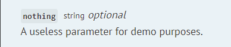
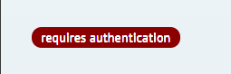
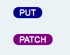

# Customizing the generated documentation
Scribe offers you multiple options to customize how your documentation is rendered.

## Manually modifying the documentation after generating
Sometimes you might need to add or remove extra information about your API that Scribe doesn't support. You can do this by editing the generated Markdown files manually, and then letting Scribe transform them to HTML.

The Markdown files are located in your `resources/docs` folder and include the following:
- `index.md`: This contains the front matter (see the [Pastel docs](https://github.com/knuckleswtf/pastel)) and the Introduction section
- `authentication.md`: This contains the Authentication section
- `groups/`: This folder contains your endpoints. Each Markdown file here represents a group of endpoints (the ones you specified by using `@group`). 
 
```eval_rst
.. Tip:: You can also add :code:`append.md` and :code:`prepend.md` files in this directory. See `Specifying content to be added to the beginning or end of the documentation`_.
```
 
Pastel will combine these files in this order (you can also see it described in the front matter of the `index.md`):
- `index.md`
- `prepend.md`
- `authentication.md`
- `groups/*` (the files here will be included in alphabetical order)
- `append.md`

```eval_rst
.. Warning:: You shouldn't create any files manually in the :code:`groups/` folder, as they will be deleted on each run,
```

After editing the Markdown files, you can use the `scribe:generate` command to rebuild your docs. 

```eval_rst
.. Tip:: You can pass the :code:`--no-extraction` flag to tell Scribe to skip the extraction phase and go straight to converting your Markdown to HTML.
```
 
If you run the `generate` command after modifying any of the generated Markdown files (even without the `--no-extraction`) flag, Scribe **will not** overwrite your changes to that file. To force Scribe to overwrite them, use the `--force` flag. 

This means that if, for instance, you modify the `groups/user-management.md` file, the information about your endpoints in the "User management" group will remain the same until you use the `--force` option.

## Specifying content to be added to the beginning or end of the documentation
If you wish to automatically add the same content to the docs every time you generate (for instance, a longer introduction, a disclaimer or a list of possible error responses), you can add a `prepend.md` or `append.md` file to the `resources/docs` folder. They will be included in the generated documentation in the order described above.
 
The contents of `prepend.md` will be added after the Introduction section, while the contents of `append.md` will show up at the end of the document.
 

## Adding more example languages
For each endpoint, an example request is shown in [each language configured](config.html#example-languages). To add a language which is not supported by this package, you'll have to create your own view for how an example should render. Here's how:
 
First, publish the vendor views by running:
 
 ```bash
 php artisan vendor:publish --provider="Knuckles\Scribe\ScribeServiceProvider" --tag=scribe-views
 ```
 
This will copy the views to `resources/views/vendor/scribe`.
 
Next, create a file called `{language-name}.blade.php` (for example, `ruby.blade.php`) in the `partials/example-requests` directory. 

You can then use Blade templates to write Markdown that describes how the example request for the language should be rendered. 

In the template, you have the `$baseUrl` and `$route` variables available to you.

`$baseUrl` is the base URL for the API (for instance, http://your-api.dev).

`$route` is an array with the following keys:
- `methods`: an array of the HTTP methods for that route
- `boundUri`: the complete URL for the route, with any url parameters replaced (`/users/{id}` -> `/users/1`)
- `headers`: key-value array of headers to be sent with route (according to your configuration)
- `cleanQueryParameters`: key-value array of query parameters with example values to be sent with the request.
- `cleanBodyParameters`: key-value array of body parameters with example values to be sent with the request.
- `fileParameters`: key-value array of file parameters with example values to be sent with the request. Each example value is an instance of `\Illuminate\Http\UploadedFile`.

```eval_rst
.. Important:: Parameters which have been excluded from the example requests (see `Specifying Example Values <documenting-endpoint-query-parameters.html#specifying-example-values>`_) will not be present in :code:`cleanQueryParameters`, :code:`cleanBodyParameters`, or :code:`fileParameters`.
```

```eval_rst
.. Tip:: You can make use of some utilities in the class :code:`\Knuckles\Scribe\Tools\WritingUtils` to help you easily output data in various forms (such as in key=value format or as a PHP array). Please take a look at that class and its usages in the included example request templates for details.
```

Finally, add the language to the `example_languages` array in your config and generate your documentation as usual. 

## Customizing the code used in examples
Customising existing language templates follows the same process as described above: publish assets, then modify the Blade templates in `resources/views/vendor/scribe/partials/example-requests` as necessary.

## Changing the Markdown templates
If you need to go even further, you can take a look at editing the included Blade views.

### Included views
You should see the following Blade files when you publish views:

- `index.blade.php`: This gets transformed to the `index.md`. It has access to the `$frontmatter` and `$introText` strings.
- `authentication.blade.php`: This gets transformed into the `authentication.md` file. This has access to the following variables:
   - `$isAuthed` boolean that describes if the API has an `auth` section configured
   - the `$authDescription` string that contains information parsed from the authentication type, and
   - the `$extraAuthInfo` string that contains the text in `auth.extra_info` from the config file.
   
The following Blade files are present in the `partials` directory:
- `frontmetter.blade.php`: This gets transformed into a string, which is then passed to the `index.blade.php` file as `$frontmatter`. It has access to the following variables:
   - `$showPostmanCollectionButton` boolean that is true if Postman collection generation was enabled
   - the `$postmanCollectionLink` string that contains the URL to the Postman file (typically `./collection.json`), and
   - the `$settings` array that contains `logo`, `languages` and `title`.

```eval_rst
.. Important::  These Blade files are all configured for generating Markdown which is then turned into static HTML (by Pastel). Therefore, hardcoded and relative links are used (eg :code:`<a href="./collection.json">`). For users using :code:`laravel` type documentation, these links are afterwards replaced in the generated HTML file with the correct Blade helpers (eg :code:`<a href="{{ url('docs.json') }}" >`).
```

- `group.blade.php`: This is the template for a group of endpoints. For each group of endpoints, this file is rendered, and gets transformed into the corresponding group file (for instance, endpoints with group "User Management" are passed through this template to create the file `groups/user-management.md`). It has access to the following variables:
   - `$groupName`,
   - `$groupDescription`, and
   - `$routes`, an array containing routes in that group. Each item here contains the route information described in [the plugin API](plugins.html#api), plus an `output` item that contains the Markdown for that route.
   
- `endpoint.blade.php`: This is the template for a single endpoint. For each endpoint, it gets rendered and passed back to the `Writer` class, which sets it as the `output` key in the `$route` variable before passing to the group template. It has access to the following variables:
   - `$settings` (the same settings variable passed to frontmatter),
   - `$route`: an array which contains the information extracted from the various stages (see [the plugin API](plugins.html#api) for details).
   
### Included components
There are also a number of included components that you can utilize in your Blade files, located in the `components` folder:
- `field-details.blade.php`: This is the template for rendering details about a field. It takes in the attributes `name`, `description`, `type`, and `required`. Typically, you'd use this to render a parameter in your route Blade file.



- `badges/auth.blade.php`: A simple 'requires authentication' badge. Accepts the attribute `authenticated`.

 

- `badges/http-method.blade.php`: A component to wrap a HTTP method in a badge. Takes in the `method` attribute.

 

- `badges/base.blade.php`: The base badge component, used by `auth` and `http-method`. Takes in `colour` and `text` attributes, and uses Pastel's badge classes to create a badge.

## Changing the CSS styles
The CSS styling is provided by Pastel, which currently supports only one template. Consider making a pull request to add your alternative styles.
