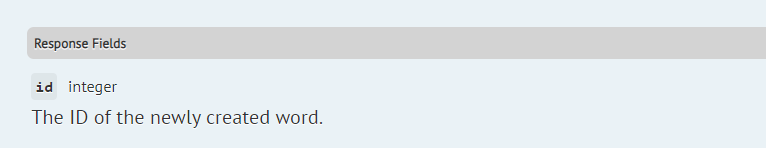

# Documenting endpoint responses
[IN PROGRESS]

## Providing an example response
You can provide an example response for a route. This will be displayed in the examples section. There are several ways of doing this.

### @response
You can provide an example response for a route by using the `@response` annotation with valid JSON:

```php
/**
 * @response {
 *  "id": 4,
 *  "name": "Jessica Jones",
 *  "roles": ["admin"]
 * }
 */
public function show($id)
{
    return User::find($id);
}
```

Moreover, you can define multiple `@response` tags as well as the HTTP status code related to a particular response (if no status code set, `200` will be assumed):
```php
/**
 * @response {
 *  "id": 4,
 *  "name": "Jessica Jones",
 *  "roles": ["admin"]
 * }
 * @response 404 {
 *  "message": "No query results for model [\App\User]"
 * }
 */
public function show($id)
{
    return User::findOrFail($id);
}
```

### @apiResource, @apiResourceCollection, and @apiResourceModel
If your controller method uses [Eloquent API resources](https://laravel.com/docs/5.8/eloquent-resources), you can use the apiResource annotations to guide the package when generating a sample response. The `@apiResource` tag specifies the name of the resource. Use `@apiResourceCollection` instead if the route returns a list. This works with both regular `JsonResource` objects and `ResourceCollection` objects.
 
 The `@apiResourceModel` specifies the Eloquent model to be passed to the resource. The package will attempt to generate an instance of the model for the resource from the Eloquent model factory. If that fails, the package will call `::first()` to retrieve the first model from the database. If that fails, it will create an instance using `new`.

Examples:

```php

/**
 * @apiResourceCollection Knuckles\Scribe\Tests\Fixtures\UserResource
 * @apiResourceModel Knuckles\Scribe\Tests\Fixtures\User
 */
public function listUsers()
{
    return UserResource::collection(User::all());
}

/**
 * @apiResourceCollection Knuckles\Scribe\Tests\Fixtures\UserCollection
 * @apiResourceModel Knuckles\Scribe\Tests\Fixtures\User
 */
public function listMoreUsers()
{
    return new UserCollection(User::all());
}

/**
 * @apiResourceCollection Knuckles\Scribe\Tests\Fixtures\UserResource
 * @apiResourceModel Knuckles\Scribe\Tests\Fixtures\User
 */
public function showUser(User $user)
{
    return new UserResource($user);
}
```

### @transformer, @transformerCollection, and @transformerModel
You can define the transformer that is used for the result of the route using the `@transformer` tag (or `@transformerCollection` if the route returns a list). The package will attempt to generate an instance of the model to be transformed using the following steps, stopping at the first successful one:

1. Check if there is a `@transformerModel` tag to define the model being transformed. If there is none, use the class of the first parameter to the transformer's `transform()` method.
2. Get an instance of the model from the Eloquent model factory
2. If the parameter is an Eloquent model, load the first from the database.
3. Create an instance using `new`.

Finally, it will pass in the model to the transformer and display the result of that as the example response.

For example:

```php
/**
 * @transformercollection \App\Transformers\UserTransformer
 * @transformerModel \App\User
 */
public function listUsers()
{
    //...
}

/**
 * @transformer \App\Transformers\UserTransformer
 */
public function showUser(User $user)
{
    //...
}

/**
 * @transformer \App\Transformers\UserTransformer
 * @transformerModel \App\User
 */
public function showUser(int $id)
{
    // ...
}
```
For the first route above, this package will generate a set of two users then pass it through the transformer. For the last two, it will generate a single user and then pass it through the transformer.

> Note: for transformer support, you need to install the league/fractal package

```bash
composer require league/fractal
```

### @responseFile

For large response bodies, you may want to use a dump of an actual response. You can put this response in a file (as a JSON string) within your Laravel storage directory and link to it. For instance, we can put this response in a file named `users.get.json` in `storage/responses`:

```
{"id":5,"name":"Jessica Jones","gender":"female"}
```

Then in your controller, link to it by:

```php
/**
 * @responseFile responses/users.get.json
 */
public function getUser(int $id)
{
  // ...
}
```
The package will parse this response and display in the examples for this route.

Similarly to `@response` tag, you can provide multiple `@responseFile` tags along with the HTTP status code of the response:
```php
/**
 * @responseFile responses/users.get.json
 * @responseFile 404 responses/model.not.found.json
 */
public function getUser(int $id)
{
  // ...
}
```

## Generating responses automatically
If you don't specify an example response using any of the above means, this package will attempt to get a sample response by making a request to the route (a "response call"). A few things to note about response calls:

- Response calls are done within a database transaction and changes are rolled back afterwards.

- The configuration for response calls is located in the `config/scribe.php`. They are configured within the `apply.response_calls` section for each route group, allowing you to apply different settings for different sets of routes.

- By default, response calls are only made for GET routes, but you can configure this. Set the `methods` key to an array of methods or '*' to mean all methods. Leave it as an empty array to turn off response calls for that route group.

- You can set Laravel config variables. This is useful so you can prevent external services like notifications from being triggered. By default the `app.env` is set to 'documentation'. You can add more variables in the `config` key.

- By default, the package will generate dummy values for your documented body and query parameters and send in the request. If you specified example values using `@bodyParam` or `@queryParam`, those will be used instead. You can configure additional parameters or overwrite the existing ones for the request in the `queryParams`, and `bodyParams` sections.

- The `ResponseCalls` strategy will only attempt to fetch a response if there are no responses with a status code of 2xx already.


## Documenting responses
 This functionality is provided by default by the `UseResponseFieldTags` strategy. You use it by adding a `@responseField` annotation to your controller method.

```
@responseField id integer The id of the newly created user
```

Note that this also works the same way for array responses. So if your response is an array of objects, you should only mention the keys of the objects inside the array. So the above annotation will work fine for both this response:

```
{
  "id": 3
}
```

and this:

```
[
  { "id": 3 }
]
```

You can also omit the type of the field. Scribe will try to figure it out from the 2xx responses for that endpoint. So this gives the same result:

```
@responseField id integer The id of the newly created user
```

Result:



