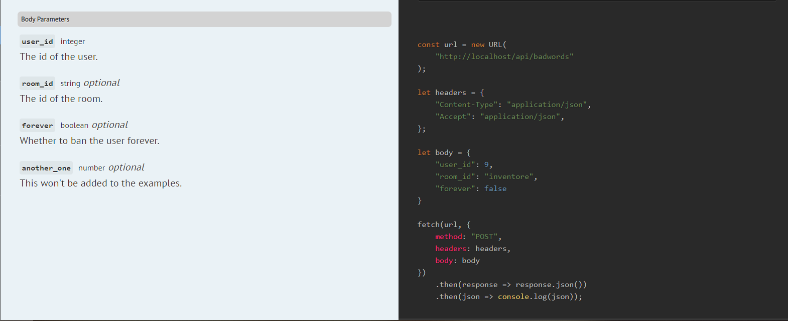
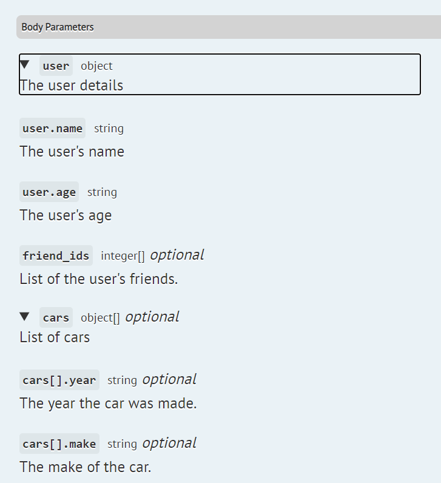
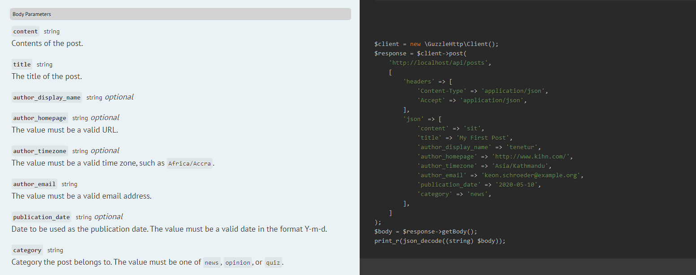
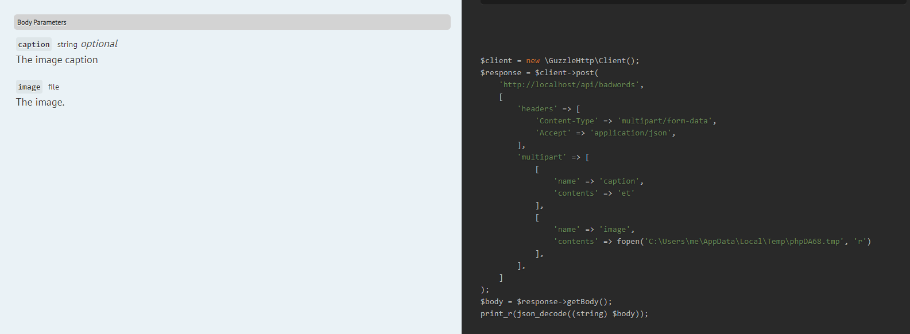

# Documenting body and file parameters for an endpoint
Scribe can get information about your endpoint's body parameters in two ways:
- the fully-manual way (using the `@bodyParam` annotation)
- the mostly-automatic way (using FormRequests)

## The manual way: Specifying body parameters with @bodyParam
To describe body parameters for your endpoint, use the `@bodyParam` annotation on the method handling it.

The `@bodyParam` annotation takes the name of the parameter, its type, an optional "required" label, and then its description. Valid types:
- `string`
- `integer`
- `number`
- `boolean`
- `object` (see [Handling array and object parameters](#handling-array-and-object-parameters) below)
- `file` (see [Documenting File Uploads](#documenting-file-uploads) below)

You can append `[]` at the end of a type any number of times to indicate an array field (`integer[]` = array of integers).

By default, Scribe will generate a random value for each parameter, to be used in the example requests and response calls. If you'd like to use a specific example value, you can do so by adding `Example: your-example-here` to the end of your description.

```eval_rst
.. Tip:: You can exclude a particular parameter from the generated examples by ending with `No-example` instead. The parameter will still be included in the text of the documentation, but it won't be included in response calls or shown in the example requests.
```

Here's an example:

```php
/**
 * @bodyParam user_id int required The id of the user. Example: 9
 * @bodyParam room_id string The id of the room.
 * @bodyParam forever boolean Whether to ban the user forever. Example: false
 * @bodyParam another_one number This won't be added to the examples. No-example
 */
public function createPost()
{
    // ...
}
```

The body parameters will be included in the generated documentation text and example requests:




If you're using a FormRequest in your controller, you can also add the `@bodyParam` annotation there instead, and Scribe will fetch it.

```php
/**
 * @bodyParam title string The title of the post.
 * @bodyParam body string required The content of the post.
 */
class CreatePostRequest extends \Illuminate\Foundation\Http\FormRequest
{

}

// in your controller...
public function createPost(CreatePostRequest $request)
{
    // ...
}
```

### Handling array and object parameters
Sometimes you have body parameters that are arrays or objects. To handle them in `@bodyparam`, Scribe follows this convention:

- For arrays: use a single field with type `<type of items>[]`. For instance, to denote an array `cars` of elements of type `integer`:
  ```
  @bodyParam cars integer[]
  ```
  
- For objects: you need a parent field with type `object` and an entry for each field, named with the dot notation `<parent name>.<field>`. For instance, to denote an object `cars` with a field `name` of type `string`:
  ```
  @bodyParam cars object
  @bodyParam cars.name string
  ```

- For an array of objects, you need a parent field with type `object[]`, and an entry for each field, named with the dot notation `<parent name>[].<field>`. For instance, to denote an array of objects `cars` with each item having field `name`:
  ```
  @bodyParam cars object[]
  @bodyParam cars[].name string
  ```

```eval_rst
.. Important:: For objects and arrays of objects, both lines are required, otherwise you might run into strange errors.
```

```php
/**
 * @bodyParam user object required The user details
 * @bodyParam user.name string required The user's name
 * @bodyParam user.age string required The user's age 
 * @bodyParam friend_ids int[] List of the user's friends.
 * @bodyParam cars object[] List of cars
 * @bodyParam cars[].year string The year the car was made. Example: 1997
 * @bodyParam cars[].make string The make of the car. Example: Toyota
 */
```




## Using FormRequests
If you're using Laravel or Dingo FormRequests in your controller method, Scribe can extract information about your parameters from your validation rules. Since these rules only describe validation logic, you can also add a `bodyParameters` method where you can add a description and example for each parameter.

**Not all rules are supported.** Here are the supported rules:
- `required`
- `bool`
- `string`
- `int`
- `numeric`
- `array`
- `file`
- `timezone`
- `email`
- `url`
- `ip`
- `json`
- `date`
- `date_format`
- `image`
- `in`

Custom rules are not supported. Scribe will ignore any rules it does not support.

For each parameter in `rules()` it encounters, Scribe will:
- generate an example value that passes all the supported rules.
- generate a description that combines the supported validation rules with any description you specify in `bodyParameters()`.

```eval_rst
.. Note:: If you have rules that are not supported, Scribe's generated value might not pass their validation checks. You can get around that by manually specifying an example in the `bodyParameters()` method.
```

Here's an example:

```php
class CreatePostRequest extends FormRequest
{
    public function rules()
    {
        return [
            'content' => 'string|required|min:100',
            'title' => 'string|required|max:400',
            'author_display_name' => 'string',
            'author_homepage' => 'url',
            'author_timezone' => 'timezone',
            'author_email' => 'email|required',
            'publication_date' => 'date_format:Y-m-d',
            'category' => ['in:news,opinion,quiz', 'required'],
        ];
    }

    public function bodyParameters()
    {
        return [
            'content' => [
                'description' => 'Contents of the post',
            ],
            'title' => [
                'description' => 'The title of the post.',
                'example' => 'My First Post',
            ],
            'publication_date' => [
                'description' => 'Date to be used as the publication date.',
            ],
            'category' => [
                'description' => 'Category the post belongs to.',
            ],
        ];
    }
}
```

This gives:

 

## Documenting file uploads
You can document file inputs by using `@bodyParam` or FormRequest rules with a type `file`. You can add a description and example as usual. 

For files, your example should be the path to a file that exists on your machine. This path should be absolute or relative to your project directory (but not in the project root). If you don't specify an example, Scribe will generate a fake file for example requests and response calls.

```php
/**
 * @bodyParam caption string The image caption
 * @bodyParam image file required The image.
 */
```

 

```eval_rst
.. Note:: Adding a file parameter will automatically set the 'Content-Type' header in example requests and response calls to `multipart/form-data`.
```
