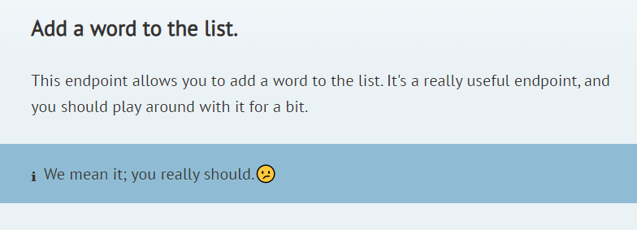
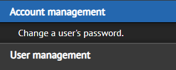
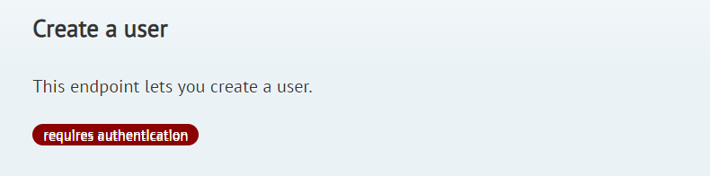

# Specifying metadata about an endpoint

## Endpoint title and description
To set an endpoint's title and description, just write in the method's docblock. The first paragraph will be used as the title, the rest as the description. Custom formatting (such as `<aside>` tags) is also supported (see the [Pastel docs](http://github.com/knuckleswtf/pastel)).

For instance, this:

```php
    /**
     * Add a word to the list.
     * This endpoint allows you to add a word to the list. It's a really useful endpoint,
     * and you should play around with it for a bit.
     * <aside class="notice">We mean it; you really should.😕</aside>
     */
    public function store(Request $request)
    {
        //...
    }
```

becomes:



```eval_rst
.. Note:: If your first line doesn't end with a period (.), you'll have to leave a blank line before the description. Otherwise, both paragraphs would be parsed together as the title.
```

## Grouping endpoints
All endpoints are grouped for easy navigation.

To add all endpoints in a controller to a group, use `@group` in the controller docblock, followed by the group's title. You can also add a description below the group.

```eval_rst
.. Tip:: You can also specify an `@group` on a single method to override the group defined at the controller level.
```

```php
/**
 * @group User management
 *
 * APIs for managing users
 */
class UserController extends Controller
{

	/**
	 * Create a user.
	 */
	 public function createUser()
	 {

	 }
	 
	/**
     * Change a user's password.
     * 
	 * @group Account management
	 */
	 public function changePassword()
	 {

	 }
}
``` 



Grouping endpoints is optional. Any endpoints not in a group will be placed in a default group, "Endpoints".

## Indicating authentication status
You can use the `@authenticated` annotation on a method to indicate if the endpoint is authenticated. A "Requires authentication" badge will be added to that route in the generated documentation. 

```eval_rst
.. Tip:: If all the routes in a controller are authenticated, you can specify `@authenticated` in the controller doc block instead. 
```

```php
    /**
     * Create a user
     * This endpoint lets you create a user.
     * @authenticated
     *
     */
     public function create()
     {    
     }
```


