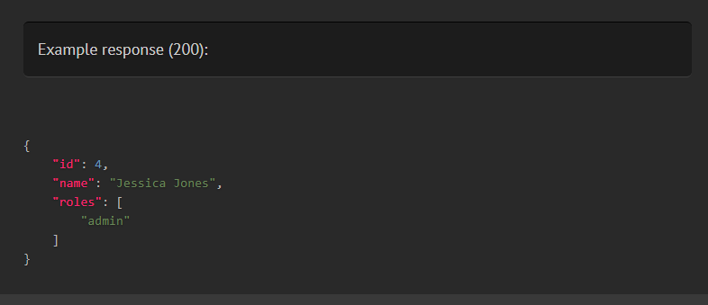
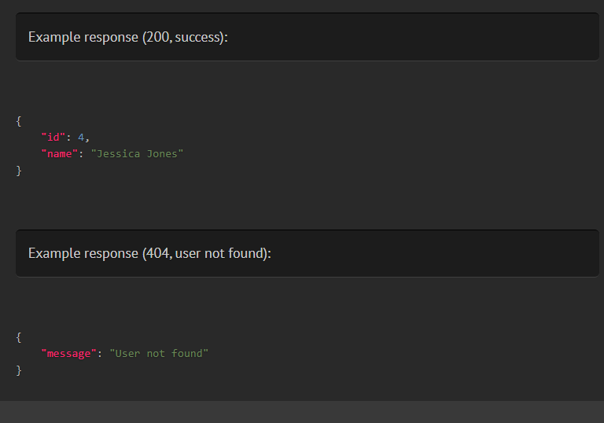
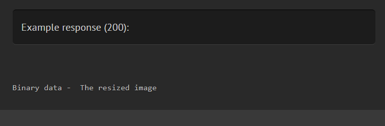
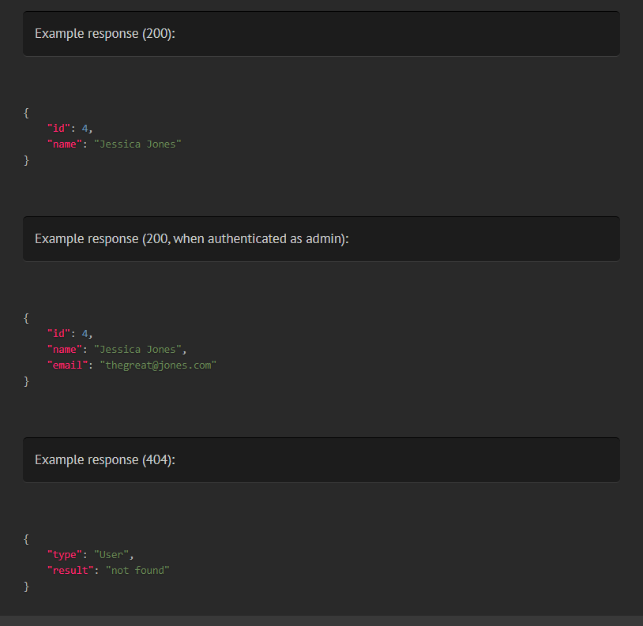
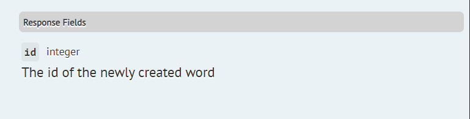
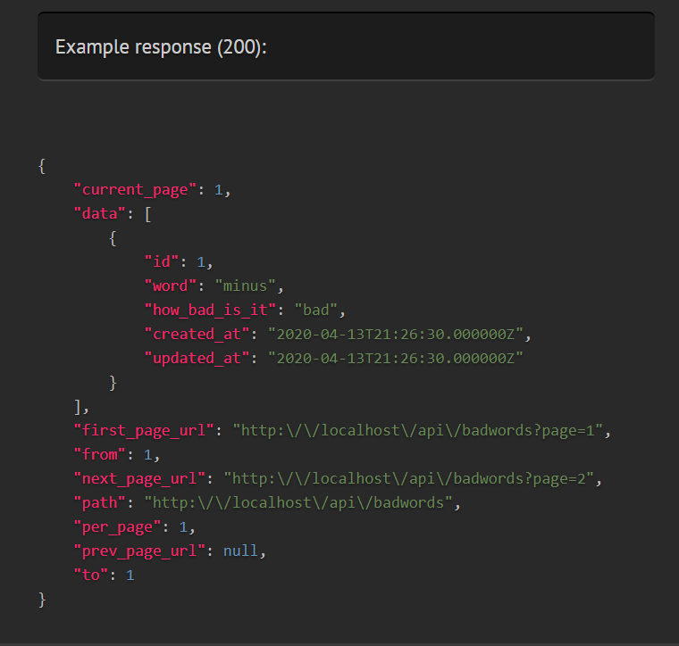

# Documenting responses from an endpoint
It's helpful if your API's consumers can see what a response should be like before writing any code. There are multiple strategies to provide example responses for your endpoint:
- describing the response using the `@response` tag
- specifying a file containing the response using the `@responseFile` tag
- letting Scribe generate the response by making a "response call"
- letting Scribe generate the response from the `@apiResource` tags (if you're using [Eloquent API resources](https://laravel.com/docs/eloquent-resources))
- letting Scribe generate the response from the `@transformer` tags (if you're using Transformers)

You can use all of these strategies within the same endpoint. Scribe will display all the responses it finds.

## `@response`
You can provide an example response for an endpoint by using the `@response` annotation with valid JSON:

```php
/**
 * @response {
 *  "id": 4,
 *  "name": "Jessica Jones",
 *  "roles": ["admin"]
 * }
 */
public function show($id)
{
    return User::findOrFail($id);
}
```



You can also specify a status code (otherwise 200 will be assumed):

```php
/**
 * @response 201 {
 *  "id": 4,
 *  "name": "Jessica Jones"
 * }
 */
```

You can define multiple possible responses from the same endpoint using `@response`. To distinguish these responses, you can use the `status` and `scenario` attributes.

```php
/**
 * @response scenario=success {
 *  "id": 4,
 *  "name": "Jessica Jones"
 * }
 * @response status=404 scenario="user not found" {
 *  "message": "User not found"
 * }
 */
```



To indicate a binary response, use `<<binary>>` as the value of the response, followed by a description.

```php
/**
 * @response <<binary>> The resized image
 */
```



## `@responseFile`
`@responseFile` works similarly to `@response`, but instead of inlining the response, you pass a file containing your JSON response. This can be helpful if your response body is large. 

To use `@responseFile`, place the response as a JSON string in a file within your Laravel storage directory and specify the relative path to it. For instance, we can put this response in a file named `users.get.json` in `storage/responses/`:

```
{"id":4,"name":"Jessica Jones"}
```

Then in the controller:

```php
/**
 * @responseFile responses/users.get.json
 */
public function getUser(int $id)
{
  // ...
}
```

You can also have multiple `@responseFile` tags on a single method, distinguished by status code and/or scenarios.

```php
/**
 * @responseFile responses/users.get.json
 * @responseFile status=200 scenario="when authenticated as admin" responses/user.get.admin.json
 * @responseFile status=404 responses/model.not.found.json
 */
```

`@responseFile` also allows you to overwrite parts of the response from the file with some data of your own. To do this, add the JSON you want to merge after the file path. For instance, supposing our generic "not found" response located in `storage/responses/model.not.found.json` says:

```json
{
  "type": "Model",
  "result": "not found"
}
```

We can change the `type` to `User` on the fly like this:

```php
/**
 * @responseFile responses/users.get.json
 * @responseFile status=200 scenario="When authenticated as admin" responses/user.get.admin.json
 * @responseFile status=404 responses/model.not.found.json {"type": "User"}
 */
```

This JSON string will be parsed and merged with the response from the file.



## Generating responses automatically via response calls
If you don't specify an example response using any of the other means described in this document, Scribe will attempt to get a sample response by making a HTTP request to the local endpoint (known as a "response call").

```eval_rst
.. Note:: Response calls are done within a database transaction and changes are rolled back afterwards, so no data is persisted.
```

The configuration for response calls is located in the `apply.response_calls` section for each route group in `config/scribe.php`. This means that You can apply different settings for different sets of routes. Here are some important things to note:

- By default, response calls are only made for `GET` routes, but you can configure this by setting the `response_calls.methods` key to an array of methods (e.g. `['GET', 'PUT']`). Set it to `['*']` to mean all methods. Leave it as an empty array to turn off response calls for that route group.

- You can specify Laravel config variables to be modified for the response call. This is useful so you can prevent external services like notifications from being triggered. By default the `app.env` is set to 'documentation'. You can add more variables in the `response_calls.config` key. 

```eval_rst
.. Tip:: You can also modify the environment directly by using a :code:`.env.docs` file and running :code:`scribe:generate` with :code:`--env docs`.
```

- By default, the package will generate dummy values for your documented query, body and file parameters and send in the request. If you specified example values using `@bodyParam` or `@queryParam`, those will be used instead. You can configure additional parameters or overwrite the existing ones for the request in the `response_calls.queryParams`, `response_calls.bodyParams`, and `response_calls.fileParams` sections. For file parameters, each value should be a valid absolute path to a file on the machine.

```eval_rst
.. Note:: If you specified :code:`No-example` for a parameter earlier, it won't be included when making a response call.
```

```eval_rst
.. Note:: Unlike the other approaches described in this document, the :code:`ResponseCalls` strategy will only attempt to fetch a response if there are no responses with a status code of 2xx already.
```

## `@apiResource`, `@apiResourceCollection`, and `@apiResourceModel`
If your endpoint uses [Eloquent API resources](https://laravel.com/docs/eloquent-resources) to generate its response, you can use the `@apiResource` annotations to guide Scribe when generating a sample response. There are three available annotations:

- `@apiResource`, which specifies the name of the resource.
- `@apiResourceCollection`, which should be used instead of `@apiResource` if the route returns a list, either via `YourResource::collection()` or`new YourResourceCollection`). Here you'll specify the name of the resource or resource collection.
- `@apiResourceModel`, which specifies the Eloquent model to be passed to the resource. You should use `@apiResourceModel` alongside either of the other two.

Examples:

```php
/**
 * @apiResource App\Resources\UserResource
 * @apiResourceModel App\Models\User
 */
public function showUser(User $user)
{
    return new UserResource($user);
}

/**
 * @apiResourceCollection App\Resources\UserResource
 * @apiResourceModel App\Models\User
 */
public function listUsers()
{
    return UserResource::collection(User::all());
}

/**
 * @apiResourceCollection App\Resources\UserCollection
 * @apiResourceModel App\Models\User
 */
public function listMoreUsers()
{
    return new UserCollection(User::all());
}
```

Scribe will generate an instance (or instances) of the model and pass the model(s) to the resource transformer to get the example response.


```eval_rst
.. Tip:: To understand how Scribe generates an instance of your model and how you can customize that, you should check out the section on `How model instances are generated`_.
```

### Paginating with API Resources
If your endpoint returns a paginated response, you can tell Scribe how to paginate by using the `paginate` attribute on `@apiResourceModel`.

```php
/**
 * @apiResourceCollection App\Resources\UserCollection
 * @apiResourceModel App\Models\User paginate=10
 */
public function listMoreUsers()
{
    return new UserCollection(User::paginate(10));
}

/**
 * @apiResourceCollection App\Resources\UserCollection
 * @apiResourceModel App\Models\User paginate=15,simple
 */
public function listMoreUsers()
{
    return new UserCollection(User::simplePaginate(15));
}
```

## `@transformer, @transformerCollection, and @transformerModel`
If you're using transformers (via the league/fractal package), you can tell Scribe how to generate a sample response by using the transformer annotations. There are three available annotations:
 
- `@transformer`, which specifies the name of the Transformer class.
- `@transformerCollection`, which should be used instead of `@transformer` if the route returns a list.
- `@transformerModel`, which specifies the Eloquent model to be passed to the transformer. You should use `@transformerModel` alongside either of the other two.
 

```eval_rst
.. Tip:: Specifying :code:`@transformerModel` is optional. If you don't specify it, Scribe will attempt to use the class of the first parameter to the transformer's :code:`transform()` method.
```

For example:

```php
/**
 * @transformer App\Transformers\UserTransformer
 * @transformerModel App\Models\User
 */
public function showUser(int $id)
{
    // ...
}

/**
 * @transformerCollection App\Transformers\UserTransformer
 * @transformerModel App\Models\User
 */
public function listUsers()
{
    //...
}
```

Scribe will generate an instance (or instances) of the model and pass the model(s) to the transformer to get the example response.

```eval_rst
.. Tip:: To understand how Scribe generates an instance of your model and how you can customize that, you should check out the section on `How model instances are generated`_.
```

### Paginating with transformers
If your endpoint uses a paginator with the transformer, you can tell Scribe how to paginate via an additional tag, `@transformerPaginator`.

```php
/**
 * @transformerCollection App\Transformers\UserTransformer
 * @transformerModel App\Models\User
 * @transformerPaginator League\Fractal\Pagination\IlluminatePaginatorAdapter 15
 */
public function listMoreUsers()
{
  $paginator = User::paginate(15);
  $users = $paginator->getCollection();

    $transformer = new Fractal\Resource\Collection($users, new UserTransformer(), 'data');
    $transformer->setPaginator(new IlluminatePaginatorAdapter($users));
    
    return $fractal->createData($users)->toArray();
}
```

## How model instances are generated
When generating responses from `@apiResource` and `@transformer` tags, Scribe needs to generate a sample model to pass to the resource or transformer. Here's the process Scribe follows:
 
1. First, it tries the Eloquent model factory: `factory(YourModel::class)->create()`. 

```eval_rst
.. Note:: Scribe uses :code:`create()` instead of :code:`make()` when calling the factory, but runs it in a database transaction which is rolled back afterwards, so no data is persisted.
```

2. If that fails, Scribe calls `YourModel::first()` to retrieve the first model from the database. 

3. If that fails, Scribe creates an instance using `new YourModel()`.

### Applying factory states
If you want specific states to be applied to your model when instantiating via `factory(YourModel::class)`, you can use the `states` attribute on `@apiResourceModel` or `@transformerModel`. Separate multiple states with a comma.

```php
/**
 * @apiResourceCollection App\Resources\UserCollection
 * @apiResourceModel App\Models\User states=student,verified
 */
```

### Loading specific relations
If you want specific relations to be loaded with your model when instantiating via `YourModel::first()`, you can use the `with` attribute on `@apiResourceModel` or `@transformerModel`. Separate multiple relations with a comma.

```php
/**
 * @apiResourceCollection App\Resources\UserCollection
 * @apiResourceModel App\Models\User with=teacher,classmates
 */
```

## Adding descriptions for fields in the responses
You can add descriptions for fields in your response by adding a `@responseField` annotation to your controller method.

```php
/**
 * @responseField id The id of the newly created word
 */
```

Scribe figures out the type of the field from the 2xx responses for that endpoint. 

```eval_rst
.. Tip:: You don't need to specify the full field path if the field is inside an array of objects or wrapped in pagination data. For instance, the above annotation will work fine for all of these responses:

  .. code:: json 
  
     { "id": 3 }

  .. code:: json 

      [
        { "id": 3 }
      ]

  .. code:: json 

      {
         "data": [
           { "id": 3 }
         ]
      }
```






If you wish, you can also specify the type of the parameter:

```php
/**
 * @responseField id integer The id of the newly created word
 */
```

