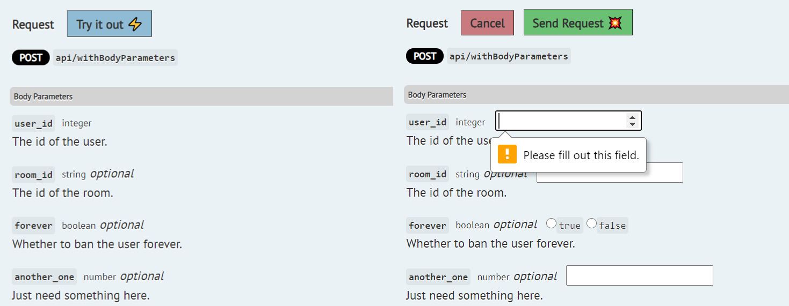
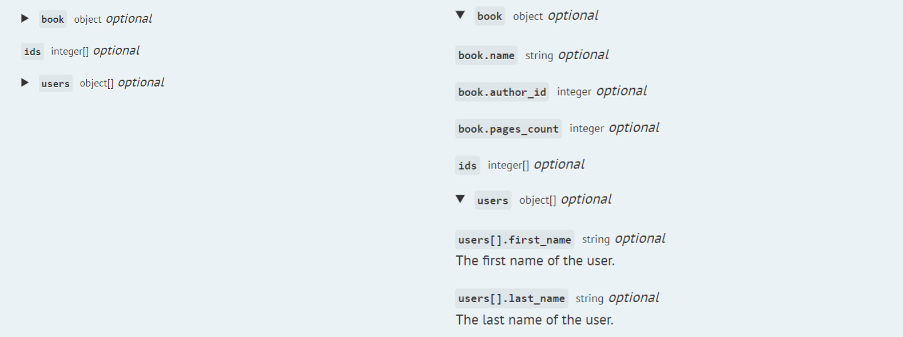

# Scribe 2: What's new, and how to migrate

Scribe 2 comes with a bunch of changes focused on making the documentation process easier and the output nicer. There aren't many "shiny" changes, mostly improvements to what works. We've marked required changes in the list below with a "Migration Required" label.

This is also a release announcement for Scribe for JS! [Version 1 is now in out!](https://github.com/knuckleswtf/scribe-js) 🎉 

```eval_rst
.. contents:: 
   :local:
```

Start by upgrading the package version in your composer.json to `^2.0` and running `composer update knuckleswtf/scribe`. Next, make a copy of your config file before publishing the new one (`php artisan vendor:publish --tag=scribe-config`). Then, when you're done applying the changes described here, copy in any custom config for your setup.

## Changes in the output 

### "Try It Out": interactive documentation with (probably) zero config ⚡💥
Big news: Your docs will now include a "Try t Out" button that allows users to test out an endpoint, right from their browser.



To enable this, set `interactive` to true. Don't forget to enable CORS headers for your domain in your API! Here's the [full doc](./generating-documentation.html#configuring-interactive-documentation).

**Note**: If you've published the views previously, you may need to re- publish them to get the included "Try It Out" functionality.

### Object fields are now represented better in the docs
Object fields are now wrapped in a `<details>` element, so you can expand the dropdown to see fields within an object. This way, it's clearer that these are subfields within a parent.




## Changes to the config file
   
### Specify the default auth status of endpoints with `auth.default`
Previously, if you had an API with all endpoints authenticated, you had to set `auth.enabled` to true AND use `@authenticated` on every endpoint. Pain in the ass. Now you can mark all endpoints as authenticated, by setting `auth.default` to true (don't forget to set `auth.enabled` to true as well). You can also remove auth from specific endpoints with `@unauthenticated`.
   
### [Migration Required] `description` replaces `postman.description`
In 1.6.0, we added a `description` config item, where you can add a description of your API. This field is used as the `info.description` field in the Postman collection and OpenAPI spec, and as the first paragraph under the "Introduction" section on the docs webpage, before the `intro_text`. We've now removed `postman.description`.

**How to migrate**: Move the contents of your `postman.description` to `description`.

### [Migration Required] `postman.auth` has been removed in favour of `postman.overrides`
We've removed `postman.auth`. It didn't make sense to have two ways of setting Postman-specific auth information (`postman.auth` and `postman.overrides`).

**How to migrate**: If you need to set Postman-specific auth now, use an `auth` key in `postman.overrides`:

```php
'postman' => [
  'overrides' => [
    'auth' => [], // your auth info
  ]
]
```

Note that Scribe now automatically populates auth info in the collection (based on your config file), so you might not even need this.

## Changes in extracting docs
### [Migration Required] New syntax for array and object parameters
The old dot notation syntax was based on Laravel's validation syntax. However, it had a few limitations in our case. It was based on PHP semantics (for instance, JSON objects are PHP arrays), which meant it didn't fit well for documenting types. It was also unclear whether you needed or were able to document parent fields as well as individual fields.

So we've switched to a new syntax. It uses some elements of the old, but is clearer and easier to work with, and is based on JSON semantics. We believe this should make the output more intuitive to an end user.

Note that the new syntax only applies to docblocks. If you're using FormRequest validation rules, you don't need to worry about the parameter format. Scribe will transform those appropriately.

Here's a comparison of the two, using `@bodyParam` as an example:

- To denote an array `cars` of elements of type `integer`.
  
  - **Old syntax**:
  
  ```
  @bodyParam cars array
  @bodyParam cars.* integer
  ```
  
  - **New syntax**: 
  ```
  @bodyParam cars integer[]
  ```


- To denote an object `cars` with a field `name` of type `string`. No changes!
  
  - **Syntax**: 
  ```
  @bodyParam cars object
  @bodyParam cars.name string
  ```


- To denote an array of objects `cars` with each item having field `name`.
  
  - **Old syntax**: 
  ```
  @bodyParam cars.* object
  @bodyParam cars.*.name string
  ```
  
  - **New syntax**: 
  ```
  @bodyParam cars object[]
  @bodyParam cars[].name string
  ```

```eval_rst
.. Important:: In the old syntax for objects and arrays of objects, the first line was optional. In the new syntax, both lines are required. 
```

**How to migrate:**
You'll need to run a search through all your docblocks:
- Replace `.*.` with `[].` (you can automate this part safely)
- Replace `.*` fields that have an `x` type with the correct `x[]` type field. 
- `array` is no longer a valid type. Replace fields that have type `array` with the correct `x[]` type field.
- Ensure there's a parent object for any object fields. For instance, you can't have a `car.make string` field without a `car object` field, or a  `dogs[].name string` field without a `dogs object[]`.

### Types are now supported for URL and query parameters
Previously, you couldn't specify types for URL and query parameters. The idea was that it didn't make sense, since they're all passed as strings in the URL anyway. But we've changed that. The thinking now is that these types can hold semantic information, which matters to your API consumers—even though they're strings in the URL, they have actual significance outside of that. You can now pass types for URL and query parameters.

**How to migrate**:
- In your annotations: If you don't want to use this, no problem! All URL and query parameters will remain `string` by default. If you'd like to add types, just specify a type with `@urlParam` and `@queryParam` like you'd do with `@bodyParam` (after the parameter name).
- In custom strategies: Update any custom strategies you've written so they return a `type` field for each URL and query parameter

## Other changes
### `add_routes`: Postman collection route changed
When you use `laravel` type docs and have `add_routes` set to `true`, you get three routes added to your Laravel app: one for the webpage, one for the Postman collection and one for the OpenAPI spec. The route for the Postman collection was previously `/docs.json`, but has now been renamed to `/docs.postman`, to bring it in line with the OpenAPI route, which is `/docs.openapi`.

### `@responseFile` supports other directories
You can now specify a file located anywhere on your machine with `@responseFile`. The file path can either be an absolute path, a path relative to your project root, or a path relative to the Laravel storage directory.

### Postman base URL now uses Postman variables
Postman collection base URL now uses a `{{baseUrl}}` Postman variable, so you can easily change the base URL for all endpoints in your collection from within Postman.

### [Migration Required] Plugin API changes: include 'name' in parameter details
This only applies if you have created any custom strategies. All strategies that return URL, query or body parameters or response fields must now include the name of the field as a `name` field in the returned array. This means that the parameter name is going to be mentioned twice in the result from the strategy:

```php
return [
  'param1' => [ // <-- here
    'name' => 'param1',  // <-- and here
    'description' => '...'
  ],
  'param2' => [ // <-- here
    'name' => 'param2',  // <-- and here
    'description' => '...'
  ],
];
```

We know it seems silly🙂, but it's actually a small optimisation that makes things easier in the long run.

<hr>

Thanks for using Scribe! We hope you have fun and write kickass API docs! And if you'd like to get better at API documentation, I;m making a course just for you: [apidocsfordevs.com](https://apidocsfordevs.com).
