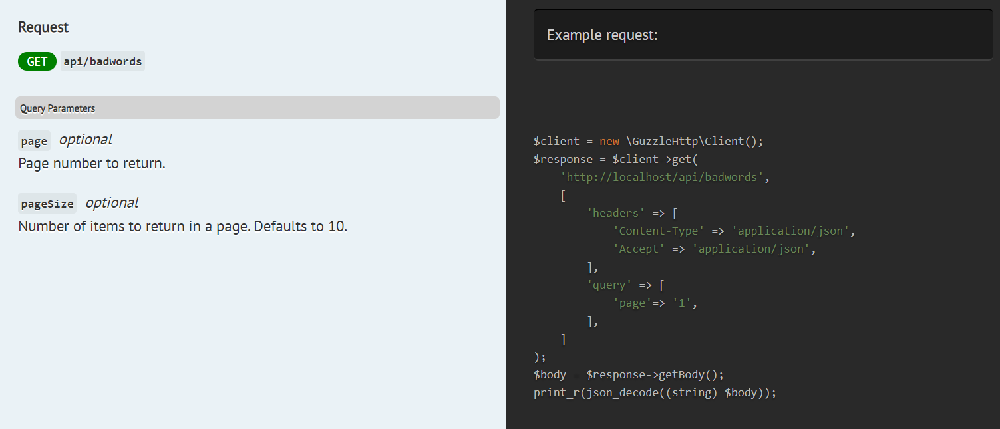

# Extending functionality with plugins
You can use plugins to alter Scribe's behaviour when extracting info about your endpoints. For instance, suppose all your listing endpoints support pagination query parameters `pageSize` and `page`, and you don't want to annotate with `@queryParam` on each method. You can create a plugin that adds this to all your query parameters. Let's see how to do this.

## The stages of route processing
Route processing is performed in the following stages, in this order:
- metadata (this includes `title`, `description`, `groupName`, `groupDescription`, and authentication status (`authenticated`))
- urlParameters
- queryParameters
- headers (headers to be added to example request and response calls)
- bodyParameters
- responses
- responseFields (descriptions of fields in the response)

For each stage, the Generator attempts to use various "strategies" to fetch data. The Generator will call all of the strategies configured in `scribe.php`, progressively combining their results together to produce the final output of that stage.

```eval_rst
.. Note:: Unlike other stages, the `responses` stage is additive. This means that all responses from all strategies in that stage will be saved. Responses cannot overwrite each other, even if they have the same status code. By contrast, if you return a value for a body parameter from one strategy, it will overwrite any other values for that parameter gotten from previous strategies.
```

There are a number of strategies included with the package, so you don't have to set up anything to get it working. Here's what's included in `scribe.php` by default:

```php

    'strategies' => [
        'metadata' => [
            \Knuckles\Scribe\Extracting\Strategies\Metadata\GetFromDocBlocks::class,
        ],
        'urlParameters' => [
            \Knuckles\Scribe\Extracting\Strategies\UrlParameters\GetFromUrlParamTag::class,
        ],
        'queryParameters' => [
            \Knuckles\Scribe\Extracting\Strategies\QueryParameters\GetFromQueryParamTag::class,
        ],
        'headers' => [
            \Knuckles\Scribe\Extracting\Strategies\Headers\GetFromRouteRules::class,
            \Knuckles\Scribe\Extracting\Strategies\Headers\GetFromHeaderTag::class,
        ],
        'bodyParameters' => [
            \Knuckles\Scribe\Extracting\Strategies\BodyParameters\GetFromFormRequest::class,
            \Knuckles\Scribe\Extracting\Strategies\BodyParameters\GetFromBodyParamTag::class,
        ],
        'responses' => [
            \Knuckles\Scribe\Extracting\Strategies\Responses\UseTransformerTags::class,
            \Knuckles\Scribe\Extracting\Strategies\Responses\UseResponseTag::class,
            \Knuckles\Scribe\Extracting\Strategies\Responses\UseResponseFileTag::class,
            \Knuckles\Scribe\Extracting\Strategies\Responses\UseApiResourceTags::class,
            \Knuckles\Scribe\Extracting\Strategies\Responses\ResponseCalls::class,
        ],
        'responseFields' => [
            \Knuckles\Scribe\Extracting\Strategies\ResponseFields\GetFromResponseFieldTag::class,
        ],
    ],
```

```eval_rst
.. Note:: The included ResponseCalls strategy is designed to stop if a response with a 2xx status code has already been gotten via any other strategy.
```

```eval_rst
.. Tip:: Check out our `community wiki <https://github.com/knuckleswtf/scribe/wiki>`_ for a list of strategies contributed by the community.
```

## Creating a strategy
To create a strategy, create a class that extends `\Knuckles\Scribe\Extracting\Strategies\Strategy`. You can do this by running the `scribe:strategy` command. By default, this will place the strategy in your `App\Docs\Strategies` namespace. The first argument to `scribe:strategy` is the name of the strategy, the second is the stage it belongs to.

```bash
php artisan scribe:strategy AddPaginationParameters queryParameters
```

This creates a class like this:

```php
<?php

namespace App\Docs\Strategies;

use Illuminate\Routing\Route;
use Knuckles\Scribe\Extracting\ParamHelpers;
use Knuckles\Scribe\Extracting\RouteDocBlocker;
use Knuckles\Scribe\Extracting\Strategies\Strategy;
use ReflectionClass;
use ReflectionFunctionAbstract;

class AddPaginationParameters extends Strategy
{
    public $stage = 'queryParameters';

    /**
     * Trait containing some helper methods for dealing with "parameters".
     * Useful if your strategy extracts information about parameters.
     */
    use ParamHelpers;

    /**
     * @link https://scribe.readthedocs.io/en/latest/plugins.html
     * @param Route $route The route which we are currently extracting queryParameters for.
     * @param ReflectionClass $controller The class handling the current route.
     * @param ReflectionFunctionAbstract $method The method/closure handling the current route.
     * @param array $routeRules Array of rules for the ruleset which this route belongs to.
     * @param array $alreadyExtractedData Data already extracted from previous stages and earlier strategies in this stage
     *
     * See the documentation linked above for more details about writing custom strategies.
     *
     * @return array|null
     */
    public function __invoke(
        Route $route,
        ReflectionClass $controller,
        ReflectionFunctionAbstract $method,
        array $routeRules,
        array $alreadyExtractedData = []
    )
    {
        return null;
    }

}
```

Alternatively, if you're creating a strategy that you'd like people to download and install via Composer, you can generate one from [this GitHub template](https://github.com/knuckleswtf/scribe-plugin-template). 

## Writing strategies
Let's take a look at the contents of our Strategy class.

First, there's a `$stage` property that states the stage the strategy belongs too. Used internally by Scribe.

The `__invoke` method of the strategy is where you extract and return data. It receives the following arguments:
- the `route` being processed (an instance of `\Illuminate\Routing\Route`)
- the `controller` handling the route (`\ReflectionClass`)
- the `method` handling the route (`\ReflectionFunctionAbstract`)
- the `rules` specified in the `scribe.php` config file for the group this route belongs to, under the `apply` section (array)
- `alreadyExtractedData`. This contains all data for the route that has been parsed thus far in the previous stages, as well as earlier strategies in this stage.
 
The strategy class also has access to the current Scribe configuration via its `config` property. For instance, you can retrieve the router in use with `$this->config->get('router')`. You can also specify a default value to be returned if the config key is not set:

```php
$router = $this->config->get('router', 'laravel');
```
 
Let's add some code to make our strategy work:
 
 ```php
    public function __invoke(
        Route $route,
        ReflectionClass $controller,
        ReflectionFunctionAbstract $method,
        array $routeRules,
        array $alreadyExtractedData = []
    )
    {
        $isGetRoute = in_array('GET', $route->methods());
        $isIndexRoute = strpos($route->getName(), '.index') !== false;
        if ($isGetRoute && $isIndexRoute) {
            return [
                'page' => [
                    'description' => 'Page number to return.',
                    'required' => false,
                    'value' => 1,
                ],
                'pageSize' => [
                    'description' => 'Number of items to return in a page. Defaults to 10.',
                    'required' => false,
                    'value' => null, // So it doesn't get included in the examples
                ],
            ];
        }

        return null;
    }
```

## Using your strategy
To use your strategy, you need to register it in the `strategies` key in the `scribe.php` file.

```php

        'queryParameters' => [
            \Knuckles\Scribe\Extracting\Strategies\QueryParameters\GetFromQueryParamTag::class,
            \App\Docs\Strategies\AddPaginationParameters::class,
        ],
```

```eval_rst
.. Tip:: You can also publish your strategy to Packagist. Then others can install them via :code:`composer require` and register them in their own configs. 
```

And we're done! Now, when we run `php artisan scribe:generate`, all our GET routes that end with `.index` will have the pagination parameters added.



## Utilities
You have access to a number of tools when developing strategies. They include:

- The `RouteDocBlocker` class (in the `\Knuckles\Scribe\Extracting` namespace) has a single public static method, `getDocBlocksFromRoute(Route $route)`. It allows you to retrieve the docblocks for a given route. It returns an array with two keys: `method` and `class` containing the docblocks for the method and controller handling the route respectively. Both are instances of `\Mpociot\Reflection\DocBlock`.

- The `ParamHelpers` trait (in the `\Knuckles\Scribe\Extracting` namespace) can be included in your strategies. It contains a number of useful methods for working with parameters, including type casting and generating dummy values for different types.

- The `DatabaseTransactionHelpers` trait (in the `\Knuckles\Scribe\Extracting` namespace), which is helpful to prevent data being persisted if your strategy needs to interact with the database. This trait contains methods to start and end database transactions.

## API
Each strategy class must implement the `__invoke` method with the parameters as described above. This method must return the needed data for the intended stage, or `null` to indicate failure.
- In the `metadata` stage, strategies should return an array with some or all of the following keys:

```
'groupName'
'groupDescription'
'title'
'description'
'authenticated' // boolean
```

- In the `urlParameters`, `queryParameters`, and `bodyParameters` stages, you can return an array with arbitrary keys. These keys will be the names of your parameters. Array keys can be indicated with Laravel's dot notation. The value of each key should be an array with the following keys:

```
'type', // Only valid in bodyParameters
'description', 
'required', // boolean
'value', // An example value for the parameter
```

```eval_rst
.. Tip:: If you would like a parameter (body or query) to be included in the documentation but excluded from examples, set `required` to false and `value` property to `null`, like we did in our example above.
```

- In the `headers` stage, you can return a key-value array of headers. You may also get rid of already set headers by setting `false` as the header value.

- In the `responses` stage, your strategy should return an array containing the responses it was able to extract. Each item in the array should be an array representing the response, with a `status` key containing the HTTP status code, and a `content` key, which is a string containing the response. For example:

```php

    public function __invoke(Route $route, \ReflectionClass $controller, \ReflectionFunctionAbstract $method, array $routeRules, array $alreadyExtractedData = [])
    {
        return [
            [
                'content' => "Haha",
                'status' => 201
            ],
            [
                'content' => '{"error": "Nope"}',
                'status' => 404
            ],
        ]
    }
```


- In the `responseFields` stage, you can return an array with arbitrary keys. These keys will be the names of fields in your response. The value of each key should be an array with the following keys:

```
'type',
'description',
```
